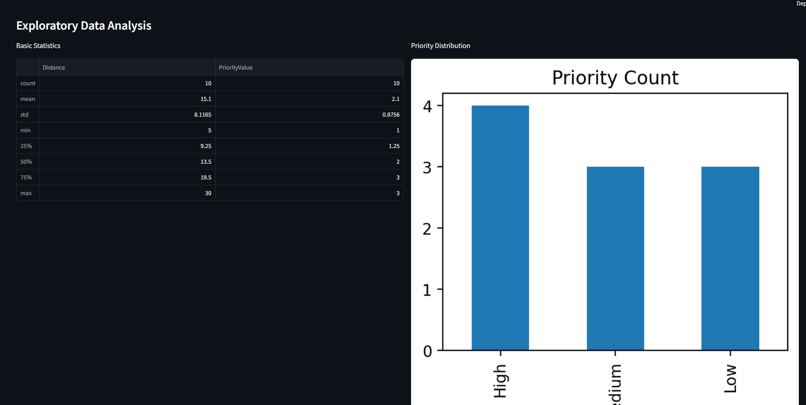
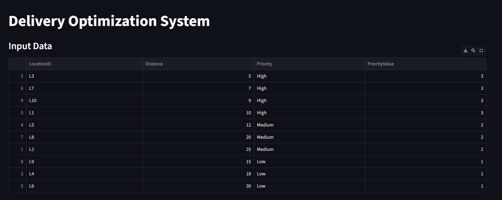
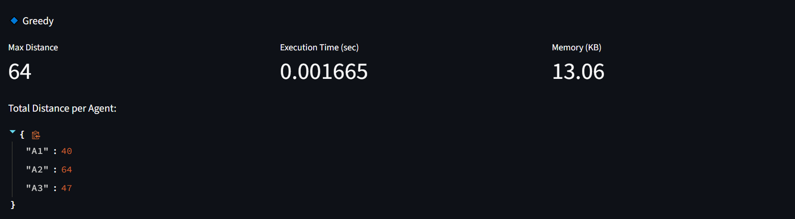
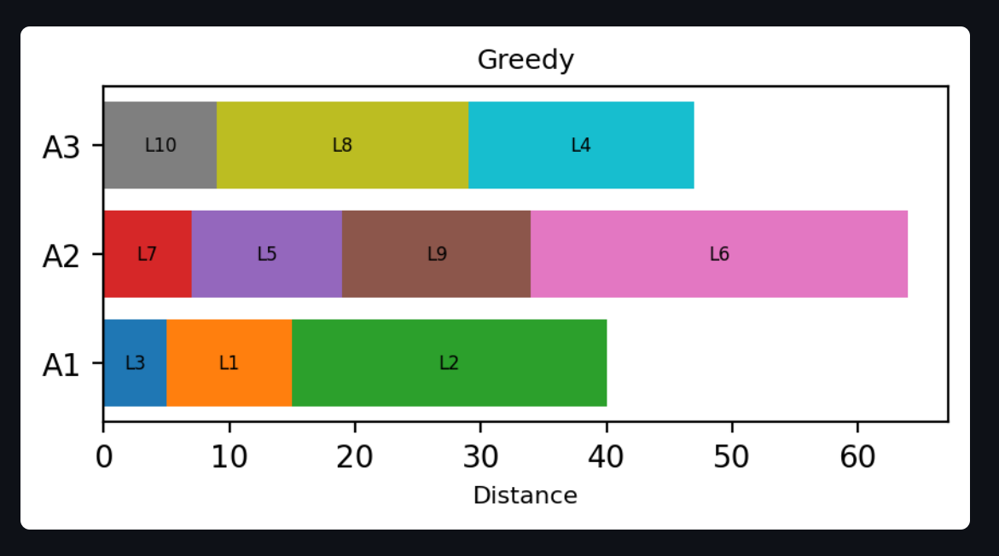
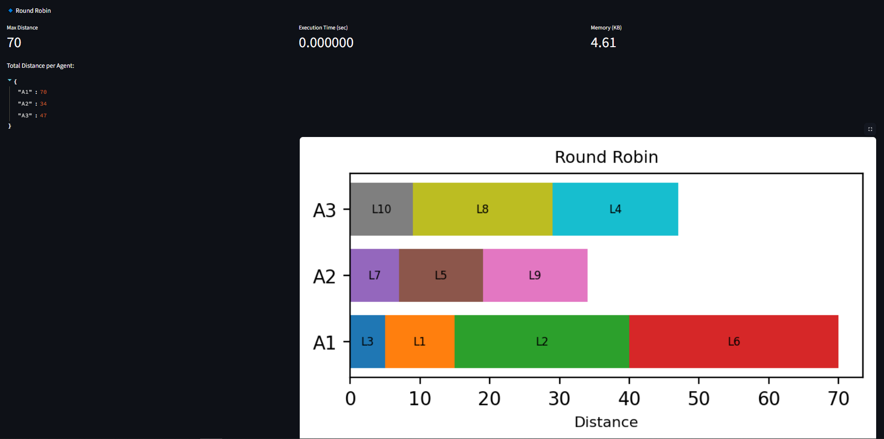
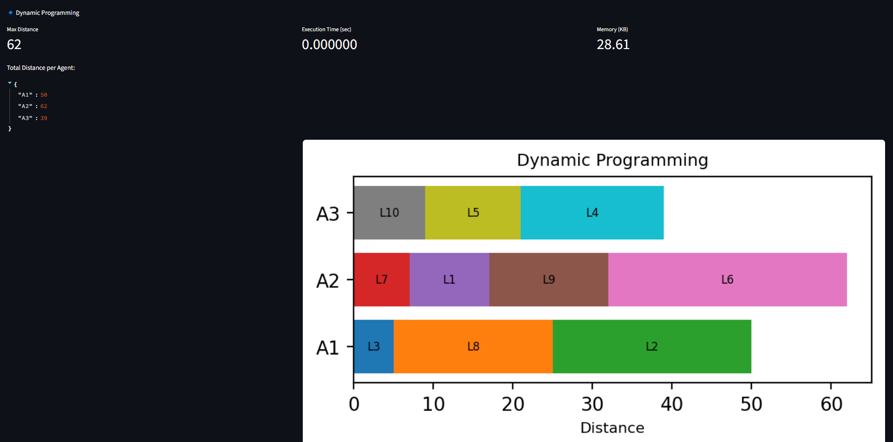
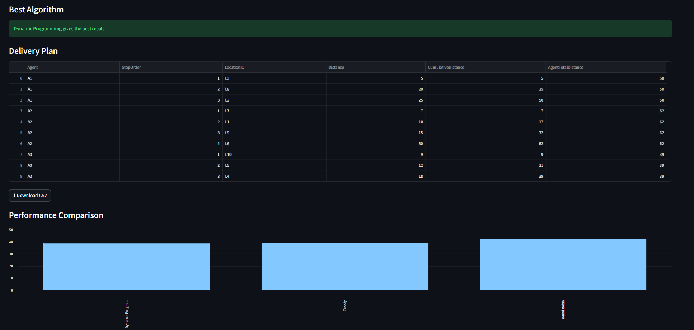

# Delivery Optimization System

## Overview

This project focuses on solving a logistics problem where deliveries need to be assigned to three agents in an efficient and balanced way. The goal is to distribute deliveries such that the total distance handled by each agent is as equal as possible, while also considering delivery priority.

The system reads delivery data from a CSV file, applies multiple algorithms, compares their performance, and automatically selects the best one.

## Problem Statement

Given a list of delivery locations with distance and priority:

* Assign deliveries to 3 agents
* Prioritize high priority deliveries
* Ensure workload is balanced across agents
* Generate a final delivery plan

## Input Format

The system expects a file named `input.csv` with the following columns:

* LocationID
* Distance
* Priority (High, Medium, Low)

Example:

LocationID,Distance,Priority
L1,10,High
L2,25,Medium
L3,5,High

## Project Structure

├── main.py
├── input.csv
├── README.md
├── output.csv
├── image.png
├── image-1.png
├── image-2.png
├── image-3.png
├── image-4.png
├── image-5.png
├── image-6.png

## How the System Works

### 1. Data Loading and Validation

* Reads the CSV file  
* Checks if required columns exist  
* Ensures distance is numeric and non-negative  
* Validates priority values  

If any issue is found, the system stops with an error message.

### 2. Exploratory Data Analysis (EDA)

Before applying algorithms, the dataset is analyzed to understand distribution, statistics, and priority patterns.

This includes:
* Summary statistics of distance values  
* Distribution of delivery priorities  
* Identifying data balance and trends  

### 3. Data Preprocessing

* Converts priority into numeric values:
  * High → 3  
  * Medium → 2  
  * Low → 1  

* Sorts deliveries by:
  * Priority (highest first)  
  * Distance (shortest first)  

This step ensures that high-priority and shorter-distance deliveries are handled first during allocation.

### 4. Algorithms Used

#### Greedy Algorithm (Load Balancing)

Assigns each delivery to the agent with the lowest current workload.

* Fast and efficient
* Works well for most cases
* May not always give the best balance

#### Round Robin

Assigns deliveries in a fixed order:

A1 → A2 → A3 → repeat

* Simple approach
* Ensures equal number of tasks
* Does not consider distance, so balance may be poor

#### Dynamic Programming (Approximate)

Attempts to split deliveries into groups with nearly equal total distance.

* Produces better balanced results
* Uses more memory
* Slower compared to greedy

## Performance Evaluation

Each algorithm is evaluated using three factors:

1. Maximum distance assigned to any agent (load balance)
2. Execution time
3. Memory usage

### Scoring Method

A weighted score is used to select the best algorithm:

Score =
(Max Distance × 0.6) +
(Execution Time × 1000 × 0.3) +
(Memory × 0.05)

Lower score indicates better performance. Higher weight is given to load balancing because minimizing maximum distance is the primary goal.

## Output

The system generates a delivery plan with:

* Agent assignment
* Order of deliveries
* Distance for each delivery
* Cumulative distance
* Total distance per agent

The output can also be downloaded as a CSV file.

## Visualization

The system displays charts showing how deliveries are distributed among agents. This helps in visually understanding load balancing.

## Example Result

Based on the sample input:

* Greedy gives fast results but slightly uneven distribution
* Round Robin performs poorly in balancing
* Dynamic Programming provides the best balance

Therefore, the system selects Dynamic Programming as the best algorithm.

## Edge Cases Handled

The system handles the following cases:

* Missing input file
* Empty dataset
* Missing or incorrect columns
* Invalid priority values
* Non-numeric distance values
* Negative distances

## Technologies Used

* Python
* Streamlit
* Pandas
* Matplotlib

## How to Run

Install required libraries:

pip install streamlit pandas matplotlib

Run the application:

streamlit run main.py

# Dashboard

* This section presents the **Exploratory Data Analysis (EDA)** of the input dataset to understand its structure and characteristics before applying optimization algorithms.

* The **basic statistics table** shows key metrics for the `Distance` and `PriorityValue` columns. The average delivery distance is 15.1, with values ranging from 5 to 30, indicating moderate variability. The priority values range from 1 to 3, with a mean of 2.1, suggesting that most deliveries fall between medium and high priority.

* The **priority distribution chart** shows that there are 4 high priority deliveries, 3 medium, and 3 low. This indicates that high-priority deliveries form the largest group, which justifies sorting and processing them first in the optimization step.

* Overall, this analysis helps confirm that the dataset is well balanced and suitable for applying delivery optimization algorithms, while also highlighting that priority-based ordering is important for better scheduling decisions.

* The given `input.csv` file is first processed by assigning numerical values to priorities (High > Medium > Low).
* Then, the data is sorted so that higher-priority deliveries come first, and within the same priority, shorter distances are prioritized.
* This ensures that important and nearby deliveries are handled earlier during optimization.

This visualization shows how the **Greedy (load balancing) algorithm** distributes deliveries among the three agents.

* Each horizontal bar (A1, A2, A3) represents an agent, and the colored segments inside it show the deliveries assigned to that agent along with their distances.
* The total distance handled by each agent is: A1 = 40, A2 = 64, A3 = 47, where A2 has the highest workload (64), which becomes the **max distance**.
* Since the greedy approach assigns tasks step-by-step to the least-loaded agent, it is fast, but the final distribution is slightly uneven compared to more optimized methods like Dynamic Programming.

* This visualization shows how the **Round Robin algorithm** distributes deliveries among the three agents.

* Each horizontal bar (A1, A2, A3) represents an agent, and the colored segments inside it show the deliveries assigned in a sequential manner. Unlike other methods, tasks are assigned one by one in a fixed order without considering current workload.

* The total distance handled by each agent is: A1 = 70, A2 = 34, A3 = 47, where A1 has the highest workload (70), which becomes the max distance.

* Since the Round Robin approach focuses only on equal distribution of tasks (not distances), it is simple and fast, but the final workload is not balanced. This makes it less efficient compared to optimized approaches like Dynamic Programming or even Greedy load balancing.

* This visualization shows how the Dynamic Programming algorithm distributes deliveries among the three agents.

* Each horizontal bar (A1, A2, A3) represents an agent, and the segments inside it show the deliveries assigned in a way that aims to balance the total distance as evenly as possible. Unlike Greedy or Round Robin, this method tries to find an optimal subset of deliveries close to one-third of the total distance.

* The total distance handled by each agent is: A1 = 50, A2 = 62, A3 = 39, where A2 has the highest workload (62), which becomes the max distance. Compared to other methods, this is more balanced overall.

* Since Dynamic Programming focuses on minimizing the difference in workload between agents, it produces a more optimized distribution, but it uses more memory and is slightly more complex than simpler approaches like Greedy.

* This output shows the final result of the system after evaluating all three algorithms and selecting the best one.

* The system has identified **Dynamic Programming** as the best algorithm because it produces the most balanced distribution of total distance among the three agents. In the delivery plan, Agent A1 handles 50, A2 handles 62, and A3 handles 39. Although A2 has the highest load, the overall difference between agents is smaller compared to other methods, making it more optimized.

* The delivery plan table clearly shows how each location is assigned step-by-step to agents, including cumulative distance tracking. The performance comparison chart further supports this decision, where Dynamic Programming has the lowest score, indicating better balance and efficiency despite slightly higher memory usage.

## When to Use Which Algorithm

- Use Greedy when speed is important and slight imbalance is acceptable
- Use Dynamic Programming when better load balancing is required
- Avoid Round Robin when distance based balancing is critical

## Conclusion

This project demonstrates how different algorithmic approaches can be applied to a real-world delivery optimization problem. By comparing multiple strategies using performance metrics, the system automatically selects the most suitable algorithm.

Dynamic Programming produces the most balanced distribution of workload, making it the preferred choice for optimization-focused scenarios. It minimizes the difference in total distance among agents, which is the primary objective of this problem.

However, the choice of algorithm also depends on the size and nature of the dataset.

For smaller datasets, Dynamic Programming is effective because it can explore combinations and achieve near optimal balancing. In this project, since the dataset is relatively small, it provides the best result.

For larger datasets, Dynamic Programming becomes computationally expensive in terms of time and memory. In such cases, the Greedy approach is more practical. It runs faster, uses minimal memory, and still produces reasonably balanced results, making it suitable for real time or large scale delivery systems.

Therefore, Dynamic Programming is preferred for accuracy, while Greedy is preferred for scalability and performance in real world applications.