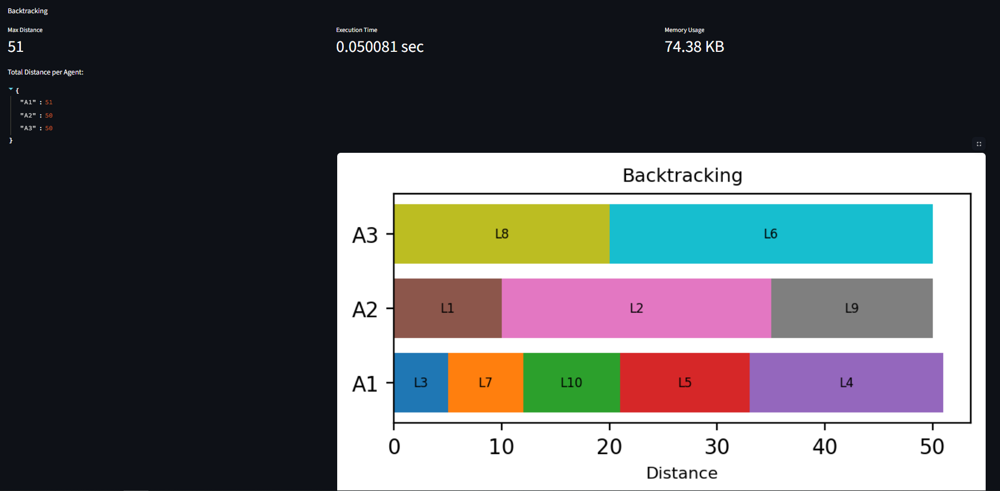
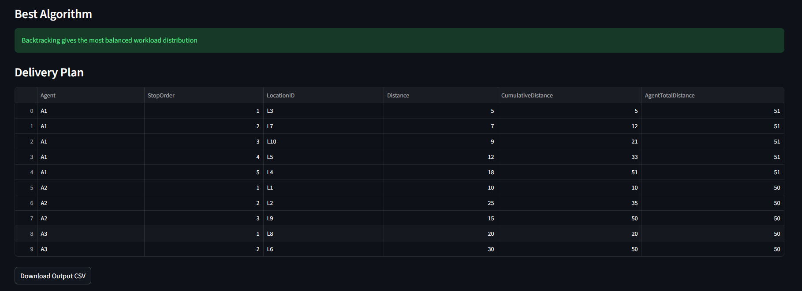

# Delivery Optimization System

## Overview

This project focuses on solving a logistics delivery optimization problem using decision analytics and optimization techniques. The objective is to assign deliveries to three agents such that the total distance handled by each agent is distributed as evenly as possible while also considering delivery priority.

The system reads delivery data from a CSV file, performs exploratory data analysis, applies multiple optimization algorithms, compares their performance, and selects the best algorithm based on decision metrics.

This project demonstrates data analysis, optimization modeling, algorithm comparison, and decision justification, which are important in decision analytics and operational optimization problems.

---

# Problem Statement

Given a list of delivery locations with distance and priority, the system must:

* Read delivery data from CSV
* Sort deliveries by priority and distance
* Assign deliveries to 3 agents
* Ensure nearly equal total distance per agent
* Generate final delivery plan
* Compare multiple algorithms and select the best approach

The main objective is **minimizing workload imbalance among agents**.

---

# Input Format

The system expects an `input.csv` file with the following columns:

* LocationID
* Distance
* Priority (High / Medium / Low)

Example:

```
LocationID,Distance,Priority
L1,10,High
L2,25,Medium
L3,5,High
L4,18,Low
L5,12,Medium
```

---

# Project Structure

```
├── main.py
├── input.csv
├── output.csv
├── README.md
├── image.png
├── image-1.png
├── image-2.png
├── image-3.png
├── image-4.png
├── image-5.png
├── image-6.png
├── image-7.png
├── image-8.png
```

---

# How the System Works

## 1. Data Loading and Validation

The system first loads the CSV file and validates the data:

* Checks if file exists
* Checks required columns
* Ensures distance is numeric
* Ensures distance is non-negative
* Validates priority values
* Stops execution if invalid data is found

This ensures the data is clean before optimization.

---

## 2. Exploratory Data Analysis (EDA)

Before applying algorithms, the dataset is analyzed to understand its structure.

EDA includes:

* Summary statistics of distances
* Priority distribution
* Dataset characteristics

This helps in understanding:

* Average delivery distance
* Distribution of delivery priorities
* Data balance
* Delivery workload patterns

This step is important because in decision analytics, **data understanding comes before decision modeling**.

---

## 3. Data Preprocessing

Priority values are converted into numeric values:

| Priority | Value |
| -------- | ----- |
| High     | 3     |
| Medium   | 2     |
| Low      | 1     |

Then deliveries are sorted by:

1. Priority (High first)
2. Distance (Shorter distance first)

This ensures:

* High priority deliveries are handled first
* Short distance deliveries are scheduled earlier
* Improves efficiency of assignment algorithms

---

# Algorithms Used

The system implements multiple algorithms to assign deliveries and compares their performance.

## 1. Greedy Algorithm (Load Balancing)

**Logic:**
Each delivery is assigned to the agent with the lowest current workload.

**Advantages:**

* Very fast
* Low memory usage
* Works well for large datasets
* Simple implementation

**Disadvantages:**

* Does not always produce optimal balance
* Makes local decisions instead of global optimization

**When to use Greedy:**

* Large datasets
* Real-time delivery systems
* When speed is more important than perfect balance
* Limited memory systems

---

## 2. Round Robin Algorithm

**Logic:**
Deliveries are assigned sequentially:
A1 → A2 → A3 → repeat

**Advantages:**

* Very simple
* Equal number of tasks per agent
* Very fast execution

**Disadvantages:**

* Does not consider distance
* Workload may be very unbalanced
* Not suitable for optimization problems

**When to use Round Robin:**

* When tasks are equal size
* CPU scheduling
* Equal task distribution problems

---

## 3. Dynamic Programming Algorithm

**Logic:**
Attempts to divide deliveries into groups where total distance is close to one-third of total distance.

**Advantages:**

* Better balance than Greedy
* Uses optimization approach
* Good for medium sized datasets

**Disadvantages:**

* Uses more memory
* Slower than Greedy
* Approximate solution

**When to use Dynamic Programming:**

* Medium sized datasets
* Optimization problems
* Subset partitioning problems

---

## 4. Backtracking Algorithm (Best Algorithm)

**Logic:**
Backtracking explores all possible delivery assignment combinations and selects the distribution that minimizes the maximum workload among agents.

**Advantages:**

* Produces optimal or near optimal solution
* Most balanced workload distribution
* Best for small datasets
* Optimal decision solution

**Disadvantages:**

* Slow for large datasets
* High memory usage
* Not scalable for very large problems

**When to use Backtracking:**

* Small datasets
* Optimal scheduling problems
* Resource allocation optimization
* Strategic planning problems

## Dashboard


* This section presents the **Exploratory Data Analysis (EDA)** of the input dataset to understand its structure and characteristics before applying optimization algorithms.

* The **basic statistics table** shows key metrics for the `Distance` and `PriorityValue` columns. The average delivery distance is 15.1, with values ranging from 5 to 30, indicating moderate variability. The priority values range from 1 to 3, with a mean of 2.1, suggesting that most deliveries fall between medium and high priority.

* The **priority distribution chart** shows that there are 4 high priority deliveries, 3 medium, and 3 low. This indicates that high-priority deliveries form the largest group, which justifies sorting and processing them first in the optimization step.

* Overall, this analysis helps confirm that the dataset is well balanced and suitable for applying delivery optimization algorithms, while also highlighting that priority-based ordering is important for better scheduling decisions.


* The given `input.csv` file is first processed by assigning numerical values to priorities (High > Medium > Low).
* Then, the data is sorted so that higher-priority deliveries come first, and within the same priority, shorter distances are prioritized.
* This ensures that important and nearby deliveries are handled earlier during optimization.


This visualization shows how the **Greedy (load balancing) algorithm** distributes deliveries among the three agents.

* Each horizontal bar (A1, A2, A3) represents an agent, and the colored segments inside it show the deliveries assigned to that agent along with their distances.
* The total distance handled by each agent is: A1 = 40, A2 = 64, A3 = 47, where A2 has the highest workload (64), which becomes the **max distance**.
* Since the greedy approach assigns tasks step-by-step to the least-loaded agent, it is fast, but the final distribution is slightly uneven compared to more optimized methods like Dynamic Programming.


* This visualization shows how the **Round Robin algorithm** distributes deliveries among the three agents.

* Each horizontal bar (A1, A2, A3) represents an agent, and the colored segments inside it show the deliveries assigned in a sequential manner. Unlike other methods, tasks are assigned one by one in a fixed order without considering current workload.

* The total distance handled by each agent is: A1 = 70, A2 = 34, A3 = 47, where A1 has the highest workload (70), which becomes the max distance.

* Since the Round Robin approach focuses only on equal distribution of tasks (not distances), it is simple and fast, but the final workload is not balanced. This makes it less efficient compared to optimized approaches like Dynamic Programming or even Greedy load balancing.


* This visualization shows how the Dynamic Programming algorithm distributes deliveries among the three agents.

* Each horizontal bar (A1, A2, A3) represents an agent, and the segments inside it show the deliveries assigned in a way that aims to balance the total distance as evenly as possible. Unlike Greedy or Round Robin, this method tries to find an optimal subset of deliveries close to one-third of the total distance.

* The total distance handled by each agent is: A1 = 50, A2 = 62, A3 = 39, where A2 has the highest workload (62), which becomes the max distance. Compared to other methods, this is more balanced overall.

* Since Dynamic Programming focuses on minimizing the difference in workload between agents, it produces a more optimized distribution, but it uses more memory and is slightly more complex than simpler approaches like Greedy.


* This visualization shows how the **Backtracking algorithm** distributes deliveries among the three agents.

* Each horizontal bar (A1, A2, A3) represents an agent, and the colored segments inside it show the deliveries assigned to that agent along with their distances. Unlike Greedy and Round Robin, the Backtracking algorithm explores multiple possible combinations of delivery assignments and selects the distribution that minimizes the maximum workload among agents.

* The total distance handled by each agent is: A1 = 51, A2 = 50, A3 = 50, where A1 has the highest workload (51), which becomes the max distance.

* Since the Backtracking approach tries different combinations to achieve the most balanced distribution, it produces a very evenly balanced workload compared to other methods. However, this method takes more execution time and memory because it checks many possible assignments before selecting the best one. This makes it more optimal in terms of workload balance but slower compared to Greedy and Round Robin.



The Backtracking algorithm is selected as the best approach because it produces the most balanced distribution of workload among the three agents. It explores different assignment combinations and minimizes the difference in total distance handled by each agent. As a result, all agents have nearly equal workloads, making the delivery plan more efficient and fair compared to other algorithms.

The algorithm selection was based on the problem objective, dataset size, and performance metrics. Since the main objective is to balance workload among agents and the dataset size is small, an optimal solution approach was preferred over faster heuristic methods. Backtracking explores multiple assignment combinations and produces the most balanced workload distribution. Therefore, considering workload balance, dataset size, execution time, and memory usage, Backtracking was selected as the best algorithm for this delivery optimization problem.

# Decision Criteria for Selecting Best Algorithm

The best algorithm was selected based on three performance metrics:

1. Workload Imbalance
   Difference between maximum and minimum total distance among agents

2. Execution Time
   Time taken by algorithm

3. Memory Usage
   Memory consumed during execution

Since the main objective is balanced workload distribution, **workload imbalance is given highest importance**.

---

# Decision Scoring Model

A weighted scoring model was used to compare algorithms.

## Scoring Formula

```
Score =
(Imbalance × 0.7) +
(Time × 1000 × 0.2) +
(Memory × 0.1)
```

## Reason for Weight Selection

| Metric             | Weight | Reason                              |
| ------------------ | ------ | ----------------------------------- |
| Workload Imbalance | 70%    | Main objective is balanced workload |
| Execution Time     | 20%    | Performance matters but not primary |
| Memory Usage       | 10%    | Less important for small dataset    |

Lower score indicates better algorithm.

This is a **multi-criteria decision model** used in decision analytics.


# How the Final Decision Was Made

The decision process followed these steps:

1. Input data was cleaned and sorted by priority and distance.
2. Four algorithms were applied:

   * Greedy
   * Round Robin
   * Dynamic Programming
   * Backtracking
3. For each algorithm, the following were measured:

   * Total distance per agent
   * Workload imbalance
   * Execution time
   * Memory usage
4. A weighted score was calculated for each algorithm.
5. The algorithm with the lowest score was selected as the best algorithm.

This makes the decision **data-driven and objective**.


# Why Backtracking Was Selected as Best Algorithm

Backtracking was selected because:

* It produced the lowest workload imbalance
* It provided the most balanced workload distribution
* It minimized maximum agent distance
* The dataset size is small, so execution time is acceptable
* Decision quality is more important than execution speed

Although Backtracking uses more time and memory, the dataset is small and the execution time difference is very small. Therefore, the improvement in workload balance is more important.

Hence, **Backtracking is the best algorithm for this problem**.


# Algorithm Selection Summary

| Algorithm           | Speed     | Memory   | Balance | Best Use Case                 |
| ------------------- | --------- | -------- | ------- | ----------------------------- |
| Greedy              | Fast      | Low      | Medium  | Large datasets                |
| Round Robin         | Very Fast | Very Low | Poor    | Equal task distribution       |
| Dynamic Programming | Medium    | Medium   | Good    | Medium datasets               |
| Backtracking        | Slow      | High     | Best    | Small datasets / Optimization |


# Output Generated

The system generates:

* Delivery assignment per agent
* Order of deliveries
* Distance per delivery
* Cumulative distance
* Total distance per agent
* Output CSV file for download


# Edge Cases Handled

The system handles the following edge cases:

* Missing input file
* Empty dataset
* Missing columns
* Invalid priority values
* Non-numeric distances
* Negative distances
* Large dataset (Backtracking skipped automatically)


# Technologies Used

* Python
* Streamlit
* Pandas
* Matplotlib


# How to Run the Project

Install dependencies:

```
pip install streamlit pandas matplotlib
```

Run the application:

```
streamlit run main.py
```


# Conclusion

This project demonstrates how decision analytics and optimization algorithms can be applied to a logistics delivery optimization problem. Multiple algorithms were implemented and compared using workload imbalance, execution time, and memory usage.

The algorithm selection was not based only on execution speed, but on decision quality. Since the primary objective was balanced workload distribution, the algorithm that minimized workload imbalance was selected using a weighted decision scoring model.

Among all algorithms, **Backtracking produced the most balanced workload distribution and achieved the best overall score**, making it the optimal solution for this delivery optimization problem.

However, algorithm selection depends on the problem size and scenario:

* Backtracking is best for small datasets and optimal decisions
* Dynamic Programming is suitable for medium datasets
* Greedy is suitable for large datasets and real-time systems
* Round Robin is suitable when tasks are equal and fairness is required

This reflects real world decision analytics where multiple models are evaluated before selecting the best decision strategy.

